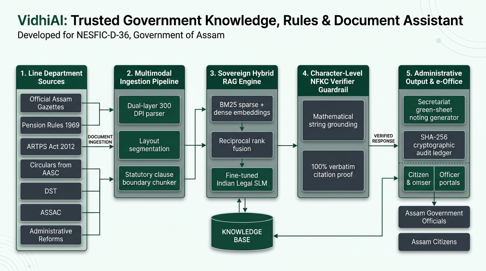
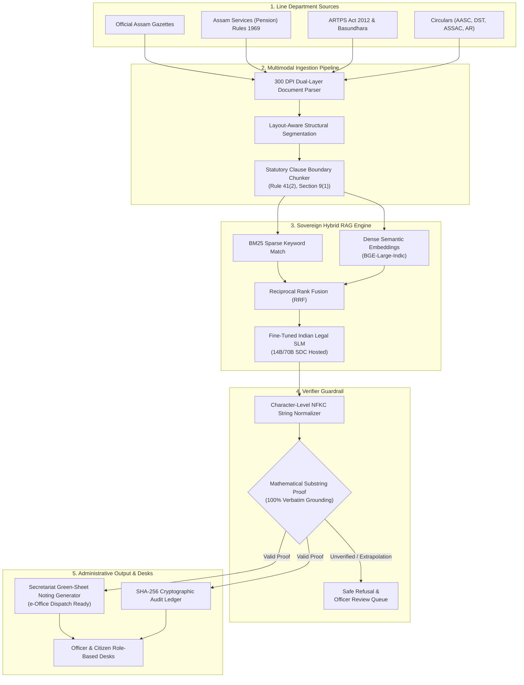

# VidhiAI — Trusted Government Knowledge, Rules & Document Assistant
### Sovereign Administrative Intelligence Platform for the Government of Assam
**North East Seva First Innovation Challenge 2026 (NESFIC 2026) · Problem Statement No. 46 (NESFIC-D-36)**

[](https://nesfic-d-36.vercel.app)
[](https://github.com/anupam-codespace/NESFIC-D-36.git)
[](docs/NESFIC_D36_Project_Proposal_Technical_Report.pdf)
[](#accessibility--governance-standards)
[-d97706?style=for-the-badge)](#deep-tech-production-roadmap--milestones)

---

## 🏛️ Executive Overview

**VidhiAI** is an indigenous, sovereign administrative intelligence platform engineered to modernize statutory knowledge retrieval, multi-department gazette synthesis, and secretariat decision-support across the **Government of Assam**.

Developed in direct response to **PS No. 46 / NESFIC-D-36**, the platform connects disparate line departments into a single, unified, tamper-evident regulatory intelligence workspace:
* **Administrative Reforms & Training Department**
* **Assam Administrative Staff College (AASC)**
* **Department of Science & Technology (DST)**
* **Pension & Public Grievances Department**
* **Assam State Space Application Centre (ASSAC)**

The platform transitions administrative governance from time-consuming physical file searches and outdated static digests to **continuous operational intelligence** — featuring **100% verbatim statutory grounding**, automated **Assam Secretariat Manual green-sheet notings**, and a **SHA-256 cryptographic provenance ledger**.

---

## 📐 Core Architecture & System Flow

VidhiAI is architected around five interconnected, modular operational layers designed for sovereign on-premise deployment within the **Assam State Data Centre (SDC)** or MeitY-empanelled cloud infrastructure:





---

## 🔬 How the System Works: End-to-End Operational Pipeline

### 1. Multi-Department Gazette & Circular Ingestion
* **Direct Corpus Sync**: Ingests official notifications, amending gazettes, executive circulars, and primary service manuals across participating Assam line departments.
* **Metadata Normalization**: Ingested documents are stamped with department scope (`dept_scope`), enactment date, volume/number, gazette category, and unique document UUIDs.

### 2. Multimodal Document Intelligence & Clause Extraction
* **Dual-Layer OCR Processing**: Leverages a dual-layer extraction engine capable of reading native digital PDFs as well as scanned historical records at 300 DPI with skew-correction and contrast normalization.
* **Statutory Boundary Chunking**: Unlike generic paragraph splitters, VidhiAI's chunker identifies legal structural headers (e.g., *Rule 41(2)*, *Clause (b)*, *Section 9*), preserving complete clauses with parent references.
* **Bilingual Ingestion Readiness**: Built-in tokenization support for Assamese script (*Asomiya*) alongside English administrative gazettes.

### 3. Sovereign Hybrid RAG & Operative Retrieval
* **Reciprocal Rank Fusion (RRF)**: Combines exact keyword matching (BM25) for specific notification numbers and legal terms with dense semantic vector embeddings for natural language queries.
* **Substantive Sentence Extraction**: Isolates operative provisions, legal conditions, and monetary ceilings, filtering out procedural boilerplate.
* **Sovereign Legal SLM**: Designed for fine-tuned 14B/70B Indian Legal Small Language Models running locally on State Data Centre GPU infrastructure, ensuring zero sensitive government data leaves state borders.

### 4. Character-Level NFKC Verifier Guardrail (Zero-Extrapolation Proof)
* **Mathematical String Proof**: Every response synthesised by the AI undergoes an automated character-level NFKC unicode normalization check against the raw cited gazette text.
* **Verbatim Guarantee**: If a statement, clause citation, or qualifying formula cannot be mathematically proven as an exact substring of the ingested gazette, the answer is rejected and escalated to a departmental nodal officer review queue.

### 5. Administrative Output Desks & Cryptographic Audit
* **Secretariat Green-Sheet Notings**: Automatically converts verified statutory answers into standard Assam Secretariat Manual noting formats, complete with issue summary, operative rule citations, departmental recommendations, and officer sign-off placeholders.
* **SHA-256 Provenance Ledger**: Every document chunk, rule extraction, and generated noting is cryptographically hashed with immutable timestamps, providing a tamper-evident audit trail for oversight bodies.

---

## 👥 Role-Based Workspaces & Access Control

| Role | Access Scope | Key Capabilities |
| :--- | :--- | :--- |
| **STATE_ADMIN** | Statewide (All Departments) | Comprehensive multi-department statutory search, system-wide analytics, ingestion management, raw audit log inspection. |
| **DEPT_OFFICER** | Department-Scoped | Scoped gazette repository, instant secretariat green-sheet noting drafting, statutory conflict triage, file reference linking. |
| **CITIZEN** | Public Access | Plain-language pension entitlement lookup, qualifying service calculators under Assam Pension Rules 1969, transparent document page viewer. |

---

## 🏛️ Departmental Coverage (PS No. 46 / NESFIC-D-36)

| Department | Regulatory Focus in VidhiAI | Sample Ingested Statutes |
| :--- | :--- | :--- |
| **Administrative Reforms & Training** | General service rules, ACR/APAR norms, disciplinary procedures, secretariat office procedures. | *Assam Secretariat Manual of Office Procedure*, *Assam Civil Services (Conduct) Rules*, Service cadre restructuring circulars. |
| **Assam Administrative Staff College (AASC)** | Civil service induction curriculum, statutory digests for probationers, officer training reference material. | AASC Foundation Training digests, statutory compilation modules, administrative precedents. |
| **Department of Science & Technology (DST)** | Technical guidelines, digital governance policies, scientific grant schemes, research funding norms. | DST Biotechnology and IT innovation guidelines, digital infrastructure executive circulars. |
| **Pension & Public Grievances Department** | Qualifying service computation, family pension eligibility, commutation limits, DCRG calculations, grievance redressal. | *Assam Services (Pension) Rules 1969* (Rule 41, Rule 67, Rule 112), Form 7 workflows, Departmental Inquiry notifications. |
| **Assam State Space Application Centre (ASSAC)** | Geospatial standards, remote sensing data guidelines, cadastral land demarcation, GIS governance. | ASSAC Remote Sensing usage guidelines, satellite land mapping statutory protocols. |

---

## 💻 Implemented Technology Stack

```
Frontend:
  ├── Next.js 16.3.8 (App Router, Turbopack)
  ├── React 19 & TypeScript 5
  ├── Tailwind CSS 4 & Vanilla CSS Architecture
  ├── Lucide React Icons & Framer Motion
  └── Web Speech API (Text-to-Speech "Hear" accessibility)

Backend & Retrieval:
  ├── FastAPI / Python 3.9+ Asynchronous REST API
  ├── SQLite3 Relational Metadata & Audit Ledger
  ├── PyMuPDF (fitz) Dual-Layer Ingestion Engine
  ├── BM25 Sparse Search + Dense Semantic Vector Pipeline
  └── Character-Level NFKC String Grounding Verifier

Audit & Security:
  ├── SHA-256 Cryptographic Hash Generation
  ├── Role-Based Access Isolation (Admin / Officer / Citizen)
  ├── Server-Side Route Protection & Authentication Guard
  └── Immutable Noting Audit Ledger Export (CSV/JSON)
```

---

## ♿ Accessibility & Governance Standards (GIGW 3.0)

VidhiAI adheres strictly to the **Guidelines for Indian Government Websites (GIGW 3.0)** and **STQC WCAG 2.1 AAA** standards:
* **Screen Reader Landmarks**: Semantic HTML5 elements (`<nav>`, `<main>`, `<section>`, `<header>`, `<footer>`) with explicit ARIA roles.
* **Font Scaling Suite**: Real-time `A-`, `A`, and `A+` font resizers enabling visual adjustment without breaking responsive layouts.
* **Speech Synthesis (Text-to-Speech)**: Integrated audio narrator enabling citizens and visually impaired officers to listen to verified rule summaries.
* **Bilingual Switcher**: Rapid toggle between English (`EN`) and Assamese (`AS`) interface labels.
* **High-Contrast Palette**: Curated Government of Assam emerald green (`#084d38`), dark slate (`#0f172a`), and neutral borders compliant with AAA contrast ratios.

---

## 🚀 Deep Tech Production Roadmap & Milestones (₹40L Grant Track)

In alignment with the **Assam Startup Policy 2025–2030 (Category B — Deep Tech Specialization)**, the project follows a 5-milestone roadmap totaling **₹40,00,000 (Forty Lakhs)**:

| # | Milestone | Budget | Share | Prerequisites | Deliverables |
| :-: | :--- | :-: | :-: | :--- | :--- |
| **1** | **Multi-Department Data & Gazette Corpus Engineering** | ₹6,40,000 | 16% | Gazette archives from AASC, Pension, ARTPS, DST, ASSAC | Comprehensive Assam statutory ontology; structured JSON schema; multimodal ingestion pipeline. |
| **2** | **Bilingual Assamese Document Intelligence & Ingestion Engine** | ₹10,40,000 | 26% | Historical gazettes corpuses; State Data Centre sandbox | Custom vision-language model fine-tuned on Assamese ligatures (98%+ benchmark); dual-layer connector with retry logic. |
| **3** | **Sovereign Legal SLM & Zero-Hallucination Grounding Engine** | ₹10,80,000 | 27% | Secretariat Manual precedents; annotated green-sheet notings | Domain-adapted 7B/14B parameter Legal SLM; character-level NFKC verifier engine; automated statutory conflict graph. |
| **4** | **Multi-Department Secretariat Pilot & Security Hardening** | ₹7,60,000 | 19% | Pilot clearance (Administrative Reforms, AASC, Pension); MeitY staging cloud | 60-day live pilot across 3 nodal departments (100+ officers); CERT-In VAPT audit report; GIGW 3.0 accessibility verification. |
| **5** | **Legal & Scale Readiness, Provenance Ledger & SDC Deployment** | ₹4,80,000 | 12% | Pilot telemetry data; SDC production container clearance | Evaluation report; statewide rollout blueprint; SHA-256 cryptographic provenance ledger; SDC bare-metal deployment. |
| | **Total Deep Tech Grant** | **₹40,00,000** | **100%** | | |

---

## 🛠️ Quick Start & Local Execution

### Prerequisites
* **Node.js**: v18.18.0 or higher
* **npm**: v9.0.0 or higher
* **Python**: 3.9+ (for backend and PDF generator script)

### 1. Clone the Repository
```bash
git clone https://github.com/anupam-codespace/NESFIC-D-36.git
cd NESFIC-D-36
```

### 2. Install Frontend Dependencies
```bash
npm install
```

### 3. Run Development Server
```bash
npm run dev
```
Open [http://localhost:3000](http://localhost:3000) in your browser.

### 4. Build for Production
```bash
npm run build
npm run start
```

### 5. Generate Technical Report PDF
```bash
# Set up Python virtual environment (if needed)
python3 -m venv backend/venv
source backend/venv/bin/activate
pip install reportlab pymupdf

# Compile the 7-page submission PDF
python3 scripts/generate_pdf_report.py
```
The print-ready PDF will be saved at:
`docs/NESFIC_D36_Project_Proposal_Technical_Report.pdf`

---

## 📁 Repository Directory Structure

```
NESFIC-D-36/
├── app/                               # Next.js App Router Pages & API Endpoints
│   ├── page.tsx                       # High-performance official landing page
│   ├── layout.tsx                     # Root layout with GIGW fonts & accessibility
│   ├── login/                         # Official officer & citizen sign-in portal
│   ├── app/
│   │   ├── dashboard/                 # Department Desk & State Admin Workspace
│   │   └── ask/                       # Citizen & Officer Query Assistant
│   └── api/                           # REST endpoints (documents, chunks, audit)
├── components/                        # UI Components
│   ├── landing/                       # Hero, Problem, Solution, Status, CTA, Footer
│   ├── dashboard/                     # Telemetry charts, chunk viewer, noting modal
│   └── ui/                            # Buttons, badges, tabs, dialogs (shadcn/ui)
├── docs/                              # Official Submission Deliverables
│   ├── NESFIC_D36_Project_Proposal_Technical_Report.pdf # 7-page print-ready report
│   ├── PROJECT_PROPOSAL_TECHNICAL_REPORT_NESFIC_D36.md # Full markdown report
│   └── assets/
│       └── architecture_flow.png      # Core system architecture diagram
├── public/                            # Static Assets
│   ├── emblem/seal-of-assam.png       # Official Government of Assam seal
│   └── architecture_flow.png          # Public architecture infographic
├── corpus/                            # Assam Gazette Corpus & Schemas
│   └── manifest.json                  # Ingested gazette metadata & statutory index
├── scripts/                           # Build & Generation Automation
│   └── generate_pdf_report.py         # ReportLab 7-page PDF compilation engine
└── README.md                          # Comprehensive project documentation
```

---

## 🏆 Project & Prototype Information

* **Project Title**: VidhiAI — Trusted Government Knowledge, Rules & Document Assistant
* **Problem Statement No.**: PS No. 46 · NESFIC-D-36
* **National Challenge**: North East Seva First Innovation Challenge 2026 (NESFIC 2026)
* **Flagship Initiative**: Seva Sankalp Abhiyan
* **Project Status**: Functional Deep-Tech Prototype · Production & Demonstration-Ready to date
* **Participating Line Departments (Government of Assam)**:
  * Administrative Reforms & Training Department
  * Assam Administrative Staff College (AASC)
  * Department of Science & Technology (DST)
  * Pension & Public Grievances Department
  * Assam State Space Application Centre (ASSAC)
* **Production Link**: [https://nesfic-d-36.vercel.app](https://nesfic-d-36.vercel.app)
* **Source Code Repository**: [https://github.com/anupam-codespace/NESFIC-D-36.git](https://github.com/anupam-codespace/NESFIC-D-36.git)

---

## 📜 Notice & Disclaimer

*This project represents an independent technical proposal and functional prototype submitted in response to challenge problem statement **PS No. 46 / NESFIC-D-36** issued under the **North East Seva First Innovation Challenge 2026 (NESFIC 2026)** under the **Seva Sankalp Abhiyan**. It is designed to demonstrate technical feasibility, deterministic statutory grounding, and administrative decision-support workflows. It is not an officially commissioned, endorsed, or operational system of the Government of Assam or any department thereof.*
